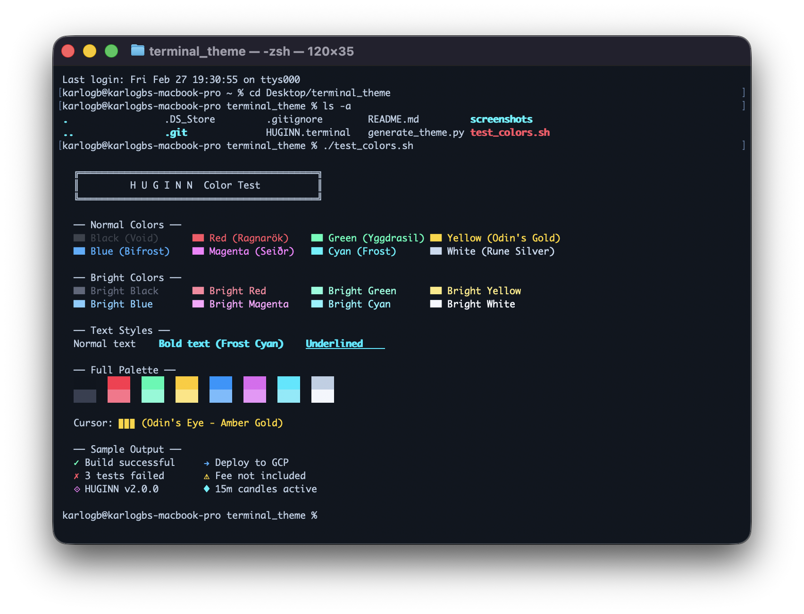

# HUGINN

### A cyberpunk terminal theme forged in the fires of Muspelheim

> *Huginn* (Old Norse: "thought") - one of Odin's two ravens who flies across Midgard
> gathering knowledge and whispering secrets to the Allfather.

A dark, neon-accented terminal theme for **macOS Terminal.app** inspired by Norse mythology and cyberpunk aesthetics.

---

## Preview



---

## Color Palette

Every color is named after a concept from Norse mythology:

| Color | Hex | Name | Origin |
|:---:|:---:|:---|:---|
|  | `#080c12` | **Ginnungagap** | The primordial void before creation |
|  | `#b0c4de` | **Rune Silver** | Color of carved rune inscriptions |
|  | `#00e5ff` | **Frost** | Ice of Niflheim, realm of cold |
|  | `#ffc107` | **Odin's Eye** | The eye sacrificed for wisdom |
|  | `#ff003c` | **Ragnarok** | The twilight of the gods |
|  | `#00ff9f` | **Yggdrasil** | Leaves of the world tree |
|  | `#0080ff` | **Bifrost** | The rainbow bridge to Asgard |
|  | `#d946ef` | **Seidr** | The color of Norse magic |

<details>
<summary><b>Full ANSI palette</b></summary>

### Normal

| ANSI | Color | Hex | Name |
|:---:|:---:|:---:|:---|
| 0 | Black | `#0d1117` | Void |
| 1 | Red | `#ff003c` | Ragnarok |
| 2 | Green | `#00ff9f` | Yggdrasil |
| 3 | Yellow | `#ffc107` | Odin's Gold |
| 4 | Blue | `#0080ff` | Bifrost |
| 5 | Magenta | `#d946ef` | Seidr |
| 6 | Cyan | `#00e5ff` | Frost |
| 7 | White | `#b0c4de` | Rune Silver |

### Bright

| ANSI | Color | Hex | Name |
|:---:|:---:|:---:|:---|
| 8 | Bright Black | `#2a3040` | Shadow Realm |
| 9 | Bright Red | `#ff5577` | Ember |
| 10 | Bright Green | `#66ffcc` | Spring Leaf |
| 11 | Bright Yellow | `#ffe066` | Mead |
| 12 | Bright Blue | `#5cadff` | Sky |
| 13 | Bright Magenta | `#e879f9` | Aurora |
| 14 | Bright Cyan | `#67e8f9` | Ice Crystal |
| 15 | Bright White | `#f0f4fc` | Moonlight |

</details>

---

## Installation

### Quick install

1. Download `HUGINN.terminal`
2. Double-click to import into Terminal.app
3. Go to **Terminal > Settings > Profiles** and set **HUGINN** as default

### From source

```bash
git clone https://github.com/karlogb/huginn-terminal.git
cd huginn-terminal
python3 generate_theme.py
open HUGINN.terminal
```

### Enable colored `ls` output

Add to your `~/.zshrc`:

```bash
export CLICOLOR=1
export LSCOLORS=GxFxCxDxBxegedabagaced
```

---

## Test colors

Run the included test script to verify all colors:

```bash
bash test_colors.sh
```

---

## Theme properties

| Property | Value |
|:---|:---|
| Background | `#080c12` with 95% opacity |
| Font | MesloLGS NF 13pt (fallback: Menlo) |
| Cursor | Block, blinking, amber gold |
| Window | 120 x 35 |
| Scrollback | 10,000 lines |
| Bell | Visual only |

---

## Regenerate

The theme is generated via Python using `NSKeyedArchiver` for proper macOS color encoding.
Edit the `COLORS` dict in `generate_theme.py` and re-run:

```bash
python3 generate_theme.py
```

---

<p align="center">
  <i>Fly forth and gather knowledge.</i>
</p>
